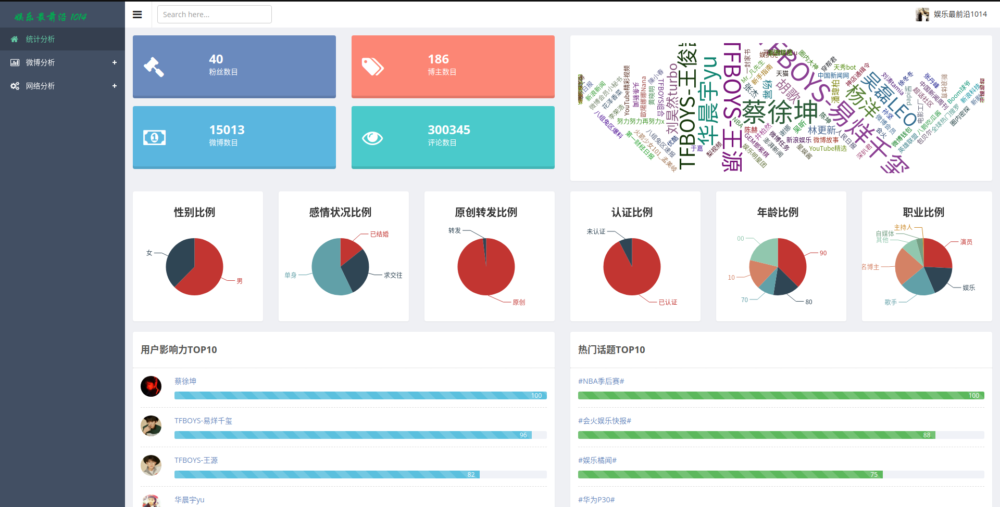
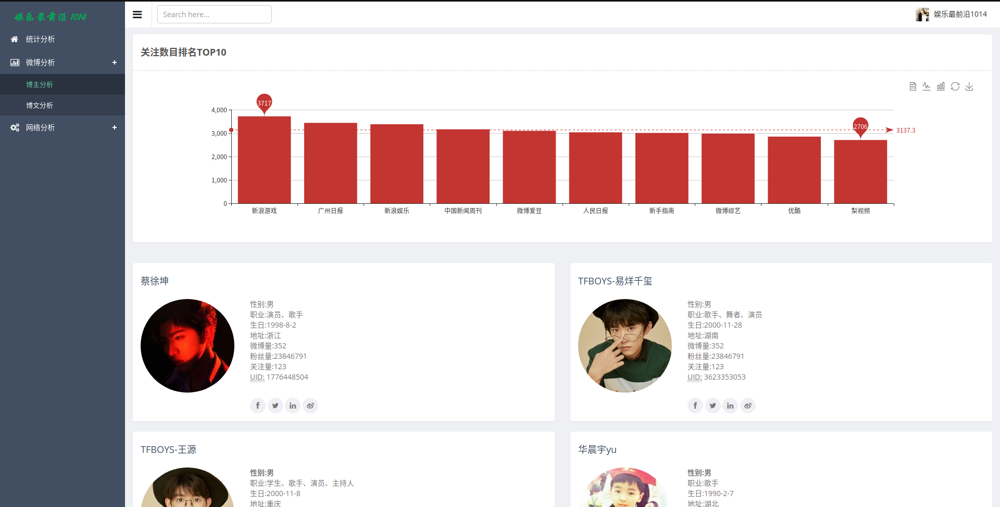
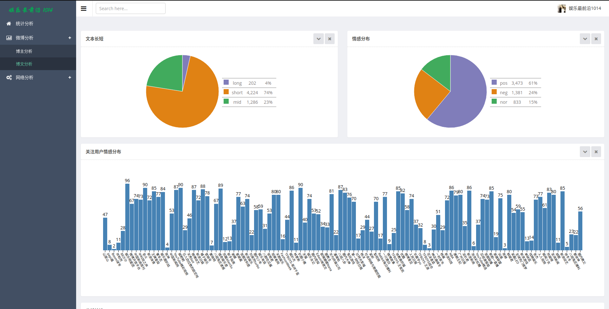
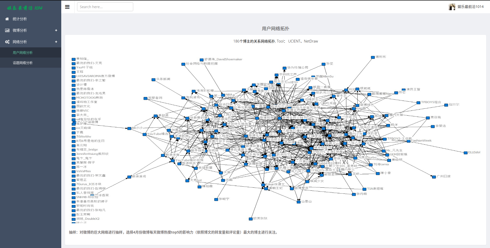

# weibo_analysis

[](https://www.apache.org/licenses/LICENSE-2.0.html)

***

**weibo_analysis 是一个能够采集微博数据,构建社交网络,同时对数据和网络进行分析的工具. **

### Environment

```
python 3.x
flask 1.x
mongodb v3.6.3
echarts 3.0
networkx 2.1
pyecharts 0.5.x
sinaweibopy3
```

### Directory

```
├── analysis 分析
├── crawl_by_api2.0 API2.0爬取
├── crawl_by_python python爬取
│   └── proxy_hellper 代理
└── web 前端可视化

analysis
    ├── bg1.jpg 词云背景图
    ├── geo_coord_map.json 地图坐标
    ├── graph_analysis.ipynb  网络分析
    ├── post_analysis.ipynb  博文分析
    ├── preprocess.ipynb 预处理
    ├── simhei.ttf  字体
    ├── stopword.txt 停用词
    ├── topic.txt 话题
    ├── triples 三元组结果
    ├── user_analysis.ipynb 博主分析
```
### Result









### Reference

- [weibo api](https://open.weibo.com/wiki/API)
- [weibo spider](https://github.com/jasonhavenD/Weibo)
- [proxy builder](https://github.com/jasonhavenD/DJH-Spider/blob/master/gen_proxy.py)
- [financial_entity_construction](https://github.com/jasonhavenD/financial_entity_construction)
- [networkx](http://networkx.github.io/)

### Contributer

**社交网络小组成员**